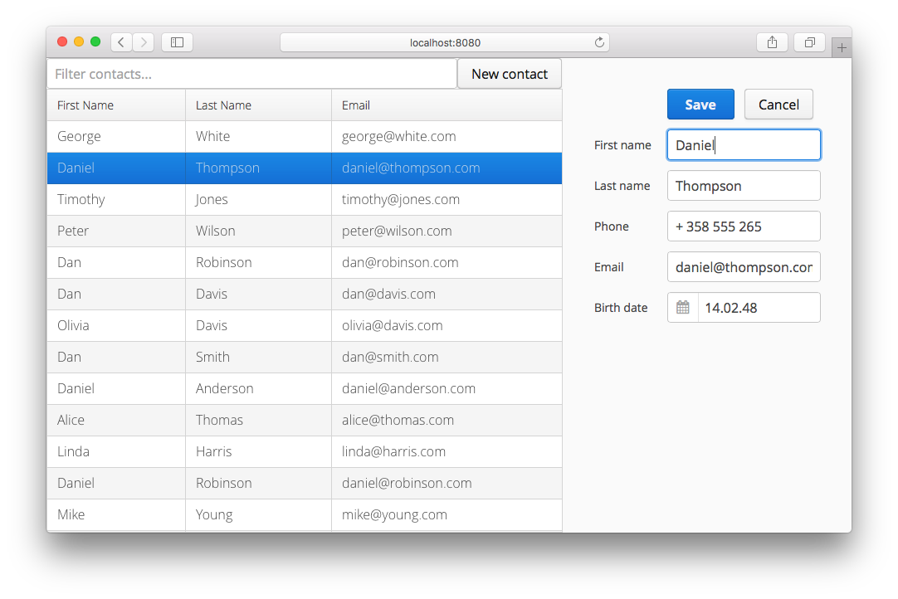
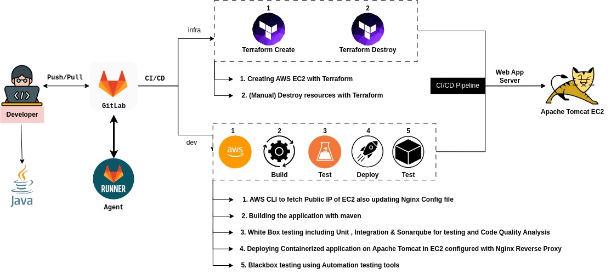

**Addressbook Deployment Automation with Gitlab CI/CD**
=======================================================

### **Required:**
* JDK : 8-11
* Maven : 3.6.3
* Tomcat : 8-9

### **Gitlab-Variables to set :**
* AWS_ACCESS_KEY_ID
* AWS_REGION
* AWS_SECRET_ACCESS_KEY
* CHANNEL
* SONAR_HOST_URL
* SONAR_TOKEN
* SLACK_TOKEN
* gitlab_user
* gitlab_password
* SLACK_WEBHOOK_URL
* SLACK_CHANNEL




**Running the example from the command line** 
-------------------
```
$ mvn clean install
```
* This creates a war file in target/addressbook.war
* Move or Copy this war file to Tomcat /usr/local/tomcat/webapps/ directory
* Now we can access the Application at `http://localhost:8080/addressbook/`

# CI/CD Pipeline Configuration

This repository contains the configuration for the CI/CD pipeline of a Java application using GitLab CI/CD. The pipeline automates the build, test, deployment, and vulnerability scanning processes.



## Pipeline Overview

The CI/CD pipeline consists of the following branches and stages:

### Development Branch (dev)

- Check EC2 instance
- Build
- Unit Test
- Integration Test
- SonarQube Check
- Deploy
- Vulnerability Scan

### Infrastructure Branch (infra)

- Create EC2
- Destroy EC2

Each stage performs specific tasks to ensure the successful delivery of the application.

## Getting Started

To set up the CI/CD pipeline, follow these steps:

1. Clone the Repository .
2. Create an AWS key pair for EC2.
2. Configure the necessary environment variables in your GitLab project:
    - `AWS_ACCESS_KEY_ID`: AWS access key ID for the EC2 instance.
    - `AWS_SECRET_ACCESS_KEY`: AWS secret access key for the EC2 instance.
    - `AWS_REGION`: AWS region of the EC2 instance.
    - `gitlab_user`: GitLab username for Docker image pushing.
    - `gitlab_password`: GitLab password for Docker image pushing.
    - `SLACK_TOKEN`: Slack token for vulnerability scan reporting.
    - `CHANNEL`: Slack channel to upload vulnerability scan reports.
3. Customize the pipeline stages and jobs as per your project requirements.
4. Commit and push the `.gitlab-ci.yml` file to your GitLab repository.
5. GitLab CI/CD will automatically trigger the pipeline whenever changes are pushed to the repository.

## Pipeline Details

### Development Branch

For detailed information about each stage and job of the pipeline on the development branch, refer to the [.gitlab-ci.yml](.gitlab-ci.yml) file.

### Infra Branch

For detailed configuration, please refer to the [`.gitlab-ci-infra.yml`](https://gitlab.com/om-projects/project-one/-/blob/infra/.gitlab-ci.yml?ref_type=heads) file on the `infra` branch.
